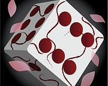
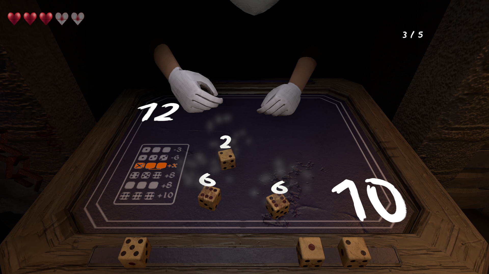
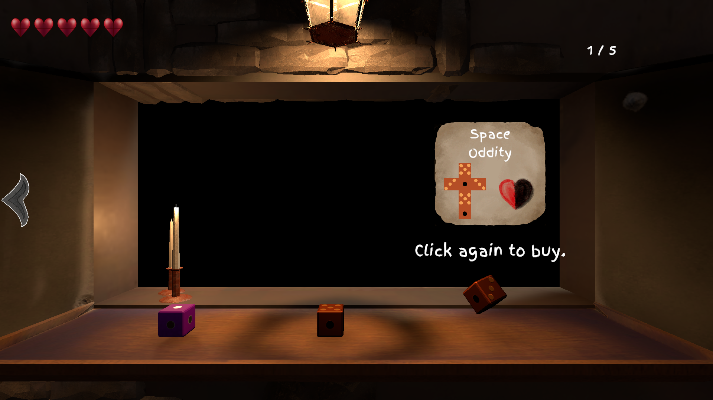
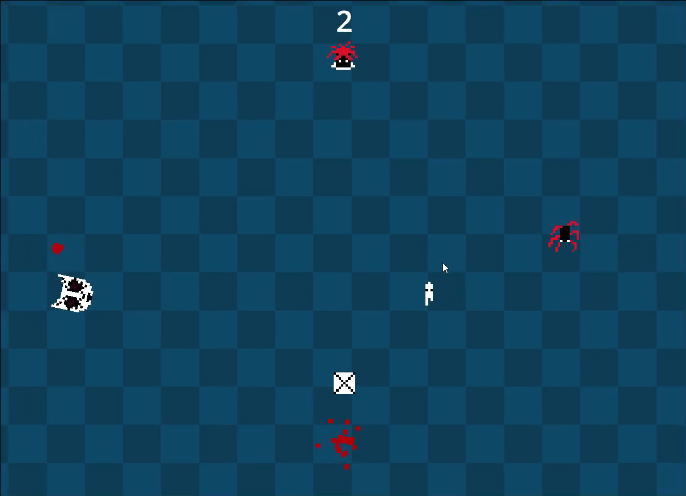

# This is me

Hello, my name is Maksim Vlasov, I am a game designer and programmer, studying at KAMK Finland.   
I am proactive and dedicated, have plenty of experience playing various games of many genres.
 

My all time favourites are: 
- Dark Souls
- Resident Evil series
- Monster Hunter Wilds

Every time I play a game I always pay attention to details: when I visit a city or a castle in an RPG, I pay attention to the architecture, the way the buildings are structured, how the streets are laid out; try to imagine how this place would be defended in case of attack. When I play shooter games with made up firearms I think if or how this design could work in real life, how I could improve it.

I developed this approach after playing Dark Souls for the very first time. It never seases to amaze me how much detail you can put in a game, that is referred to as "unfinished". Every place you visit - littered with tiniest puzzle pieces for people to find and connect. Every item you find - meager in words, but so rich in information.

This game inspired me to become a Game Designer, and still inspires me to improve, to some day become one of the greatest.

# School Projects
During my years of study in KAMK I have participated in developing some great games that I am very proud of. 
Here I will showcase some of them, as well as explain exactly what I was responsible for during development.

  
  

    <h2>
      Strung Flowers
    </h2>
  

  
  
  
Strung Flowers is a game made on Unity and released on itch.io with ~5k views and 288 downloads as of <b>April 2026</b>.

Here are some notable things I was responsible for

<b>Dice functionality: </b>
- Side detection
- Score numbers

Dice were made with expandability in mind, so new ones can be easily added by simply duplicating the base one, applying a new texture and changing side value numbers if needed.
  
  

<b>Shop label:</b>
- Automatically assigns price, name and texture

This one is my favourite feature of this project, as it works so well together with all dice.

  

Apart from that, I was actively participating in designing the game: dice functionality, dice names, enemy designs as well as design documentation were all done by me.

  
  

    <h2>
      DumbshoW
    </h2>
  

  

  
  

DumbshoW was made as a part of the Global Game Jam in 2 days by me and my friend.

We both took part in designing the core mechanics, gameplay and style.

Programming-wise I was responsible for:
- Player
  - Movement
  - Box throwing
- Enemies
  - Movement + AI
  - Box stun
  - Dying
- Boxes
  - All that box do

