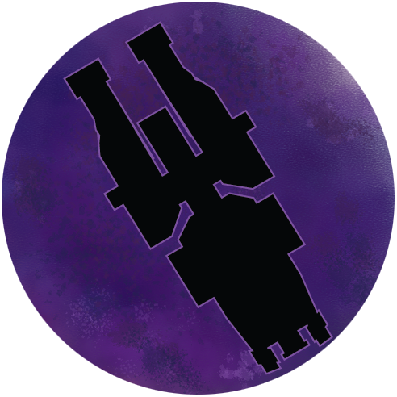
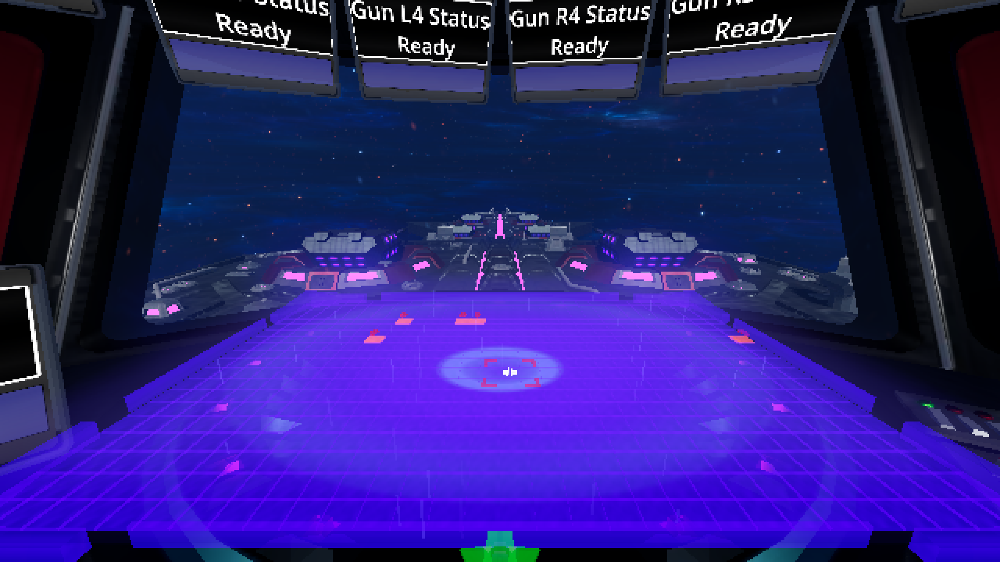
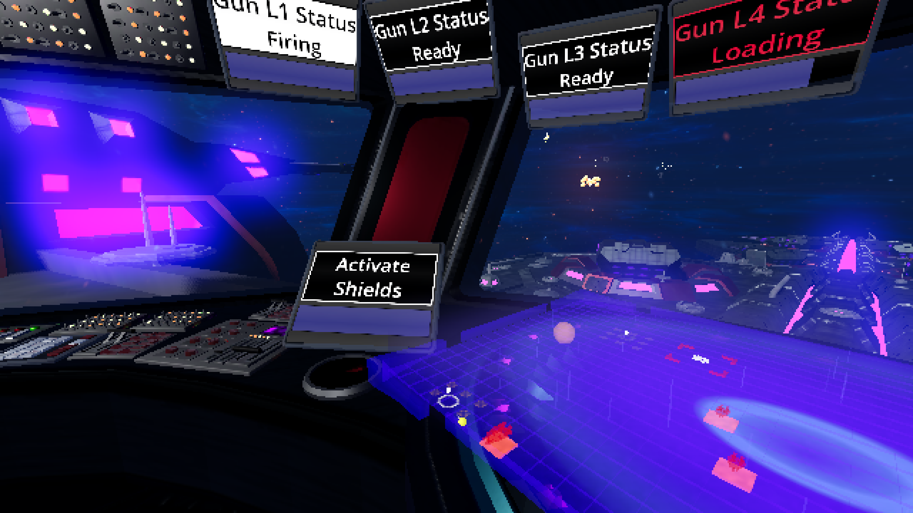
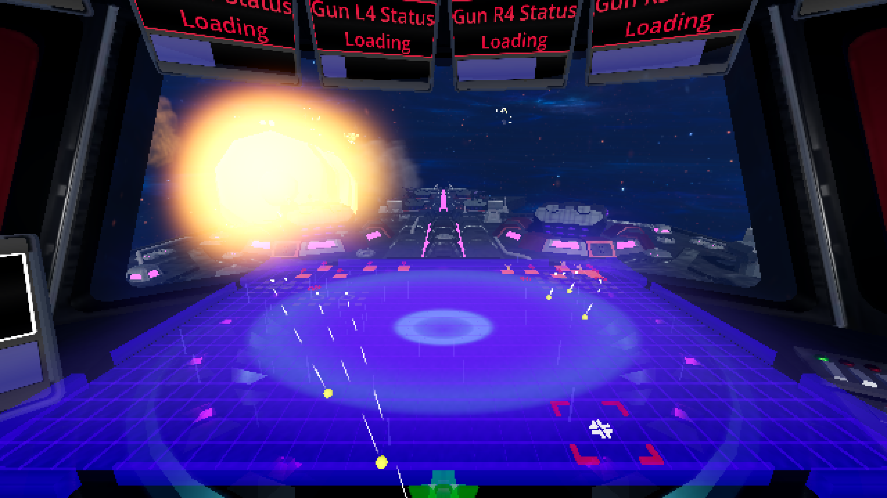
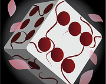
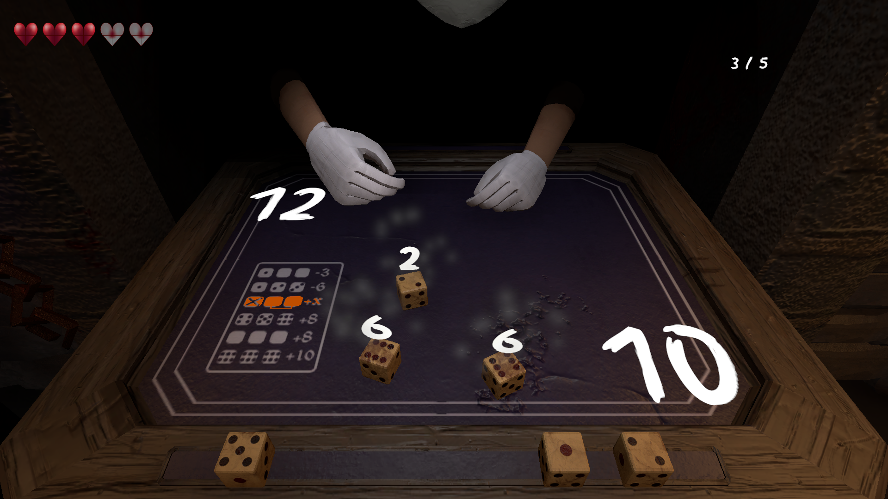
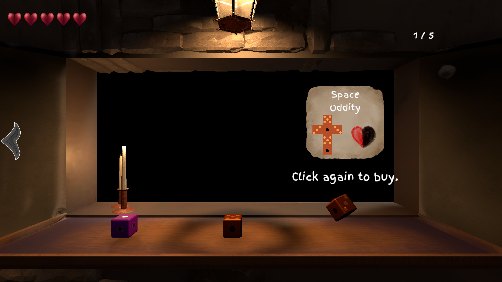
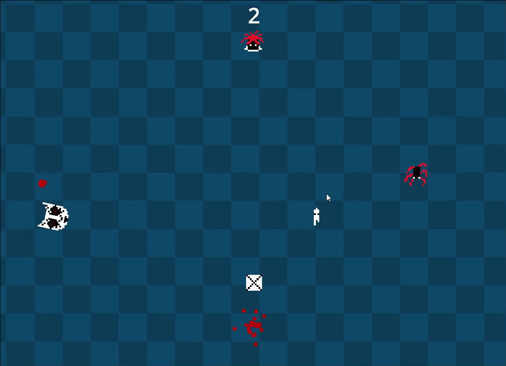

# Maksim Vlasov — Gameplay Programmer

Game development student at KAMK (Kajaani University of Applied Sciences), Finland. I build gameplay systems in Unity and Godot with a focus on mechanics that are easy to extend, and I contribute to design on every project I work on, from core mechanics to full design documentation.

My eye for design comes from Dark Souls: I pay attention to how small details like level architecture and item descriptions carry a game's world, and I build systems that leave room for that kind of content.

- **Tech:** Unity (C#), Godot ([GDScript / C#])
- **Also:** Game design, design documentation, client communication

---

## Spaceship Cannoneer

| Role | Engine | Team | Duration | Client |
|---|---|---|---|---|
| Gameplay Programmer, Design Lead | Godot | 4 people | [X months] | [Kalla Gameworks](https://www.kallagameworks.com/) |

An atmospheric first-person strategy game: you command a giant spaceship lost deep in enemy territory, and the only way to survive is to manage your cannons and hold off the waves of enemies closing in. Built as a demo prototype for an external client, Kalla Gameworks, to present to one of their partner companies. Released on itch.io for Windows and Linux in April 2026.

**Systems I built**
- **Holographic map:** tile functionality, map enemies, cannon tile targeting and shooting, VFX implementation
- **Exterior cannon sync:** cannon visuals outside the ship stay synchronized with the map
- **Cannon status screen:** full screen functionality

These systems depended on features two other programmers were building at the same time, in an engine none of us had much experience with. We planned the integration points ahead so each part could plug in as soon as it was ready.

**Design and production**
- Led design decisions on gameplay mechanics and visual style
- Acted as the team's contact with the client; our only brief was an old GDD for a different game, so we met regularly to agree on changes and direction
- Wrote all design documentation

<!-- Add a code snippet here, e.g. the cannon targeting logic, or a GIF of the map in action -->

  
  

---

## Strung Flowers

| Role | Engine | Team | Duration |
|---|---|---|---|
| Gameplay Programmer, Designer | Unity | 10 people | [X months] |

A roguelike deckbuilding dice game: gamble your way out of hell by beating Satan's underling at dice three times, then face Satan himself. Special dice from the shop improve your odds, but you pay for them with your own health. Released on itch.io with ~5k views and 288 downloads as of April 2026.

**Systems I built**
- **Dice:** side detection and score numbers. Built for expandability: a new die is created by duplicating the base die, applying a texture and setting its side values.
- **Shop labels:** automatically assign price, name and texture to the die for sale, so new dice can easily be added to the shop. My favorite feature of the project, because it works so well with every die.

**Design**
- Designed dice functionality, dice names, the gameplay loop and enemies together with the team
- Wrote all project documentation

<!-- Add a code snippet here, e.g. dice side detection -->

---

## DumbshoW

| Role | Engine | Team | Duration | Event |
|---|---|---|---|---|
| Programmer, Co-designer | Godot | 2 people | 2 days | Global Game Jam [YEAR] |

An arcade survival game: dodge the deadly mask, throw boxes to stun enemies, and turn the mask against them to survive as long as you can. We came up with a highly replayable concept, built a working prototype in two days, and left room to expand it with more mechanics later.

**Systems I built**
- **Player:** movement, box throwing
- **Enemies:** movement and AI, getting stunned by boxes, dying
- **Boxes:** all box behavior and interactions

**Design**
- Co-designed the core mechanics, gameplay and visual style

---

More projects on [my itch.io page](https://marmonkin.itch.io/).
